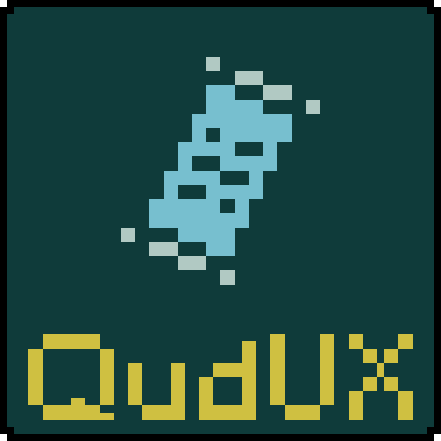

# QudUX

QudUX 2.0 is the successor to the [original QudUX](https://github.com/egocarib/CavesOfQud-QudUX-v1) mod for Caves of Qud. It has been completely re-written from the ground up. 

All features can now be individually toggled on or off in the Options menu.

Features
---------
- Automatically track visited locations in your journal (green checkmark or grey questionmark) [`PNG preview`](https://i.imgur.com/7EjlkMb.png)
- Mark legendary creatures in your journal through Look or interaction menu. [`GIF preview`](https://i.imgur.com/2VMiWLb.gif)
  - And view their recorded faction relationships in the journal entry.
- Find village quest givers more easily (conversation [`PNG preview`](https://i.imgur.com/BlUTRuY.png) an visual effect [`GIF preview`](https://i.imgur.com/5uez0p5.gif))
- Ask traders when they'll restock in a lore-friendly dialog [`PNG preview`](https://i.imgur.com/PVhW7Ks.png)
- Preview your builds in a revamped text console UI build library [`GIF preview`](https://i.imgur.com/rWVgJdo.gif)
- Choose **any** sprite for your character - during character creation, by keybind, or by wish. [`GIF preview`](https://i.imgur.com/Gkhl5BO.gif)
- Manage inventory in a revamped text console UI inventory screen [`video preview`](https://youtu.be/kmBPPIo_6Ig)
  - Rearrage item categories on different tabs
  - View item value-per-pound with a button toggle
- Do your cooking in brand new text console UI cooking screens [`video preview`](https://youtu.be/pYr_74r5_V4)
  - Brand new UI for *Choose ingredients to cook with*
  - Brand new UI for *Cook from a recipe*
- Collapse sections in the text console UI trade screen [`PNG preview`](https://i.imgur.com/MPz3nHH.png)
- See ability descriptions and willpower-adjusted cooldown details for **all** activated abilities on the abilities screen [`GIF preview`](https://i.imgur.com/qdwLXIU.gif)
- Disable auto-pickup for specific items through item interaction menu, such as ape pelts or HE Missiles [`PNG preview`](https://i.imgur.com/eo9ZwF2.png)
- Get particle text indicators when you're blocked at a zone border or when you've paused before entering deep/dangerous liquids [`GIF preview`](https://i.imgur.com/7jHm9N7.gif)
- Enjoy a unique, dedicated sprite for arrows [`PNG preview`](https://i.imgur.com/9XGyjFZ.png)
  - This is a temporary feature until a sprite is added to the base game
- Optionally, prevent pulsed field magnets from ripping your items away. This option is off by default.

Install
-------
The mod can be installed directly from this repository by downloading the code and following [these mod installation instructions](https://cavesofqud.gamepedia.com/Modding:Installing_a_mod#Manual_Download).

It is also available on the Steam workshop: https://steamcommunity.com/sharedfiles/filedetails/?id=1804499742

Technical Notes
---------------
QudUX 2.0 now relies primarily on Harmony injection to make its modifications, which is a far simpler (and more performant) framework than the Unity MonoBehavior polling that was previously used. Caves of Qud supports Harmony injection natively; Harmony is packaged with the game executable.
